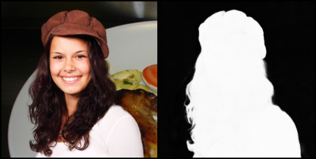
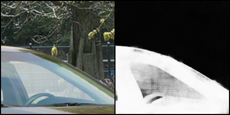
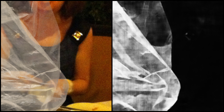
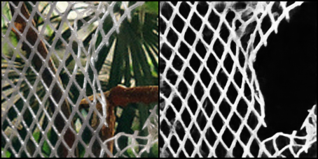

# AMSMNet
Attention Multi-scale Deep Alpha Matting network is a tri-map(side information) free deep image matting network.

## Dependencies
* NumPy
* pytorch
* OpenCV

## Dataset
### Adobe Deep Image Matting Dataset
Follow the instruction [instruction](https://sites.google.com/view/deepimagematting) to contact author for the dataset.

## Data
I have trained the model using the adobe dataset and provide a pretrained model.
You can define your customized dataloader based on the files in `data_loader` directory.
### Dataset
Write dataset class refer to `data_loader/create_dataset.py`.
### Dataloader
Write dataloader class refer to `data_loader/data_loaders.py`.

## Usage
### Train
```shell
$ python train.py -c config.json
```
### Resume
```shell
$ python train.py --resume /dir/to/the/saveing/checkpoint -c config.json
```
### Finetune
Finetune from a pretrained checkpoint.
```shell
$ python train.py -r /dir/to/the/checkpoint -c config.json
```

If you want to visualize during training, run in your terminal:
```shell
$ tensorboard --logdir saved/runs/
```

## Test
Use `test.py` to test your dataset.

### Results

From a best checkpoint of medium-depth network that are trained for 60 epoch. 





